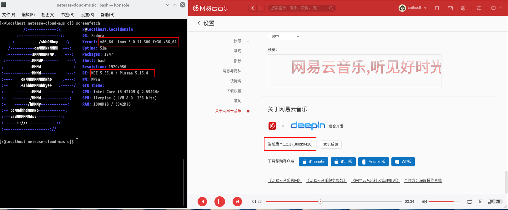

# Fedora-网易云音乐一键安装脚本

该脚本测试于 Fedora-KDE-29上。其他版本自测，理论通用

## 如何使用

下载仓库

```
git clone https://gitee.com/xuthus5/fedora-netease.git
```

加权限运行

```
cd fedora-netease

chmod +x *.sh
sudo ./install.sh
```

说明：目前使用上，我发现如果没有登录会出现网络出错的问题。使用是还请登录。

## 结果演示




若需要卸载，执行 uninstall.sh 脚本。可以干净清除

```
sudo ./uninstall.sh
```

说明：该脚本水准小白，没什么高度，勿喷。